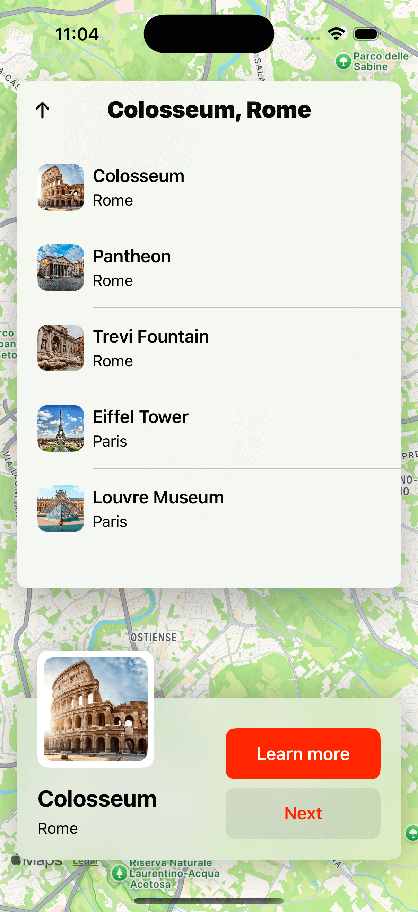

# 🗺️ MapApp

MapApp is an iOS application built with SwiftUI that provides users with an interactive map experience. The app integrates location-based services to display maps, track user locations, and provide navigation features.

## 📌 Features

- 🗺️ **Interactive Map** – View and explore different locations with smooth map navigation.
- 📍 **User Location Tracking** – Get real-time updates on your current location.
- 🔍 **Search Places** – Find specific locations on the map.
- 🚀 **SwiftUI-Based UI** – A modern and fluid design with animations.
- 🌙 **Dark Mode Support** – Seamless adaptation to system-wide dark mode.

## 🛠️ Technologies Used

- **Swift** – Primary programming language for iOS development.
- **SwiftUI** – Modern UI framework for building declarative user interfaces.
- **MapKit** – Apple’s framework for embedding maps and handling location data.
- **Core Location** – Used to access and track the user’s current location.

## 📷 Screenshots

### Home Screen


### Location Select


### Location Details


## 🏗️ Installation & Setup

1. Clone the repository:
   ```sh
   git clone https://github.com/mohebboules/MapApp.git
   ```
2. Open the project in Xcode:
   ```sh
   cd MapApp
   open MapApp.xcodeproj
   ```
3. Install dependencies (if applicable):
   ```sh
   swift package resolve
   ```
4. Run the app on a simulator or a real device:
   ```sh
   Cmd + R
   ```

## 📌 Requirements

- macOS with **Xcode (latest version)** installed.
- iOS **14.0+**
- Internet and location services enabled.

## 👨‍💻 Author

Developed by **Moheb Boules** – [GitHub Profile](https://github.com/mohebboules)

---

⭐ If you like this project, consider giving it a star on GitHub!

